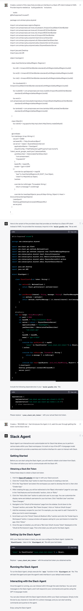

# Slack Agent

Slack Agent is an interactive and customizable bot for Slack that allows you to perform various tasks within your Slack workspace. It is built on top of the GPT-4 language model and is designed to provide a seamless and intuitive interface for users to interact with Slack.

## Getting Started

Before you can start using the Slack Agent, you will need to obtain a bot token from Slack. This token will allow your bot to communicate with the Slack API.

### Obtaining a Slack Bot Token

Follow these steps to obtain a Slack bot token:

1. Visit the [Slack API website](https://api.slack.com/apps) and sign in with your Slack account.

2. Click the "Create New App" button to start the process of creating a new bot.

3. Fill in the "App Name" and select the workspace you want to develop the bot in, then click "Create App."

4. After creating the app, you will be redirected to the "Basic Information" page for your app. In the "Add features and functionality" section, click on "Bots."

5. Click the "Add a Bot User" button to add a bot user to your app. You can customize the display name and default username for your bot here. Click "Add Bot User" and then "Save Changes."

6. Navigate to the "OAuth & Permissions" page from the sidebar. Scroll down to the "Scopes" section, and under "Bot Token Scopes," click on "Add an OAuth Scope."

7. Add the necessary scopes for your bot. For example, you may want to add "chat:write" to allow your bot to send messages.

8. Scroll back up to the "OAuth Tokens & Redirect URLs" section and click the "Install App to Workspace" button. A popup window will appear asking for your permission to install the app. Click "Allow."

9. Once the app is installed, you will see a "Bot User OAuth Access Token" displayed on the "OAuth & Permissions" page. This is the token you will use for the Slack Agent.

## Setting Up the Slack Agent

With your Slack bot token in hand, you can now configure the Slack Agent. Create a `slack.key` file in your home directory and write your bot oauth token into it. (No wrapping, no enclosing quotes, just the token itself.)

## Running the Slack Agent

To run the Slack Agent, simply execute the main function in the SlackAgent.kt file. This will start the agent and open the agent's web interface in your default web browser.

## Interacting with the Slack Agent

Once the agent is running, you can interact with it through the web interface. You can send messages to the Slack Agent, and it will respond to your commands and queries using the GPT-4 language model.

You can also interact with the Slack Agent directly within your Slack workspace. Simply invite the bot to any channel or chat with it in a direct message, and you can start sending commands and queries to the agent.

Enjoy using the Slack Agent!

